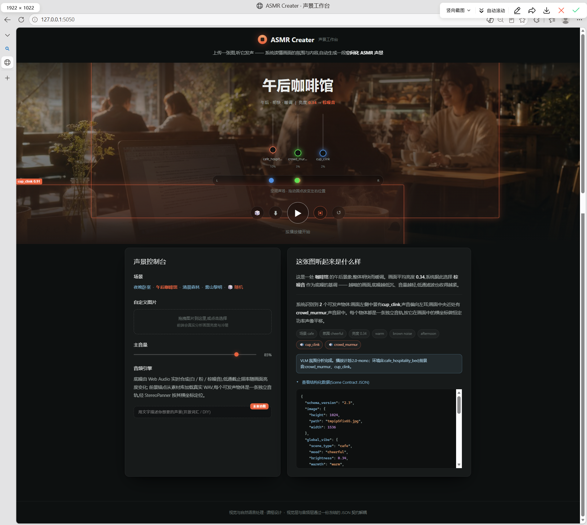

# ASMR Creater — 从图像生成空间化 ASMR 声景

> 一张图 → 视觉记录(JSON)→ 播放计划(JSON)→ 一路混好的空间化声音流

本项目是「视觉与自然语言处理」课程设计,目标是构建一条**端到端的单向映射链**:输入一张图片,系统理解画面的氛围与内容,自动生成一段"听起来确实是从这张图里长出来的" ASMR 声景,并支持基础的 2D 空间音频(物体在画面左边,声音就偏左耳)。



> 上图为实际运行截图:上传/选择图片后,系统识别出场景为 `cafe`、亮度 0.34,自动挑选 `cafe_hospitality_bed` 作为环境床,并按检测到的锚点触发 `crowd_murmur`、`cup_clink` 两层前景音;每条音轨可独立调音量,声场点可拖拽改变左右位置。

## 核心理念

整个系统是一条可插拔的映射链,**层与层之间只通过 JSON 契约通信**,可以并行开发、随意替换底层模型:

```
┌────────┐   ┌──────────────────────┐   ┌──────────────────────┐   ┌─────────────────┐
│ 输入图像│──▶│ 视觉层                │──▶│ 音频决策层            │──▶│ 播放端(浏览器)   │
└────────┘   │ · EXIF 转正 + 亮度计算 │   │ · 场景 → 环境床       │   │ · 环境床循环     │
             │ · 全局氛围 (VLM)       │   │ · 锚点 → 声音语义     │   │ · 前景定时触发   │
             │ · 物体检测 (YOLO)      │   │ · 增益/间隔/概率决策  │   │ · 2D 声像平移    │
             │ · COCO → 视觉锚点      │   │ · 空间质量门控        │   │ · 多轨混流       │
             └──────────┬───────────┘   └──────────┬───────────┘   └─────────────────┘
                        ▼                          ▼
               视觉记录 v2.3 (JSON)          播放计划 (JSON)
```

**三条关键纪律**,是这个项目区别于"随便放点音效"的地方:

1. **词表闭合** —— 场景只能从 424 个受控值里选,声音只能从 66 个受控 `sound_id` 里选,模型不许自创标签。
2. **职责分离** —— 视觉层只描述"看到了什么",绝不决定"放什么声音多大声";音频决策层只产出计划,不碰音频字节;播放端只执行计划,不做决策。
3. **证据优先** —— 检测到锚点不等于它在发声;没有可靠深度就老实回退单声道,不用边界框面积伪造距离。

## 快速开始

完整步骤(含 Ollama、YOLO 权重、素材库)见 **[部署文档.md](部署文档.md)**。最短路径:

```bash
# 1. 装依赖(建议用独立虚拟环境)
pip install -r requirements.txt

# 2. 启动 Ollama 并拉取视觉语言模型(必需,否则场景识别会退化为默认值)
ollama serve
ollama pull qwen2.5-vl:7b

# 3. 启动服务
python src/ui/app.py --port 5000
# 浏览器打开 http://127.0.0.1:5000
```

不装模型也能跑通大部分链路:回归测试与播放计划演示都不依赖 Ollama 和素材库。

```bash
python scripts/validate_examples.py         # 契约样例校验
python scripts/test_vision.py               # 视觉层 11 项
python scripts/test_playback_converter.py   # 播放计划转换器
python scripts/check_sounds_coverage.py     # 素材覆盖率
```

## 数据契约

### 视觉记录 v2.3 —— 视觉层的唯一产出

正式定义见 [`contracts/scene_contract.schema.json`](contracts/scene_contract.schema.json)(JSON Schema draft-07,程序据此校验),字段语义见 [`docs/json_contract.md`](docs/json_contract.md)。

```json
{
  "schema_version": "2.3",
  "id": "sample_bedroom",
  "image": {"path": "img_dataset/Train/42.jpg", "width": 1024, "height": 768},
  "global_vibe": {
    "scene_type": "bedroom",          // 424 个受控叶子场景之一
    "secondary_scene_types": [],      // 最多 2 个次要场景
    "scene_group": "residential_indoor",  // 由 scene_type 查表生成
    "mood": "calm", "warmth": "cool", "time_of_day": "night",
    "brightness": 0.28                // 程序计算(CIE L*),不由 VLM 估计
  },
  "trigger_anchors": [
    {
      "anchor_id": "relaxed_or_sleeping_cat",   // 87 个受控视觉锚点之一
      "bbox_norm": {"format": "xyxy", "x_min": 0.10, "y_min": 0.55, "x_max": 0.34, "y_max": 0.82},
      "confidence": 0.91,
      "source": "yoloe"
    }
  ]
}
```

**锚点不是物体类别,而是"可检测的发声证据"**:不是 `cat` 而是 `relaxed_or_sleeping_cat`(趴着睡的猫才对应呼噜声),不是 `keyboard` 而是 `hands_on_keyboard_typing`(有手在打字才对应键盘声)。普通站着的人不构成锚点,`walking_person`、`gathered_crowd` 才是。

### 播放计划 —— 音频决策层的产出

视觉记录经 [`src/audio/playback_converter.py`](src/audio/playback_converter.py) 转换为播放计划,规定每一层放哪个素材、多大增益、多久触发一次:

- **始终产出** [`2.0-mono` 单声道计划](docs/playback/单声道回退播放计划格式说明.md)
- **仅当**所有入选锚点的相对深度都通过质量门控时,才额外产出 [`2.0-binaural` 双耳 HRTF 计划](docs/playback/双耳空间播放计划格式说明.md)

计划里的环境床来自 `scene_type` 查表([`configs/playback/scene_audio_profiles.json`](configs/playback/scene_audio_profiles.json),424 个场景 100% 可解析),前景层来自锚点经 `anchor_sound_mapping_reference` 映射到 `sound_id`,并按「置信度 × 推断强度 × 助眠安全」排序后取前 2 层。

## 功能完成情况

| 能力 | 状态 | 说明 |
| --- | :--: | --- |
| 图像预处理(EXIF 转正、Letterbox、程序算亮度) | ✅ | `src/vision/preprocess.py` |
| VLM 全局氛围识别(424 场景闭合词表) | ✅ | Qwen2.5-VL via Ollama |
| YOLO 物体检测 → 视觉锚点映射 | ⚠️ | 87 锚点中当前可产出 **34** 个,见下方限制 |
| 视觉记录 v2.3 + 严格 Schema 校验 | ✅ | 不合规直接拒绝,不放脏数据下行 |
| 音频决策层(场景→环境床、锚点→声音、增益/调度) | ✅ | 线上与离线共用同一套代码 |
| 素材库(20 类环境音 + 66 类触发音) | ✅ | 215 个文件,全部 CC0,48kHz/PCM_16 |
| 浏览器端播放(真实 WAV、定时触发、变体轮换) | ✅ | Web Audio API 执行播放计划 |
| 2D 声像平移 + 可拖拽声场 | ✅ | 按锚点框水平中心定位 |
| 双耳 HRTF 空间音频 | ❌ | 缺单目深度模型,见下方限制 |
| Web UI(选图/上传、播放控制、逐轨音量、JSON 查看) | ✅ | Flask + 原生 JS |

## 已知限制

这些是**项目当前真实的边界**,不是待修的 bug:

1. **87 个视觉锚点中只有约 34 个能被实际检出。** 底层是 COCO 80 类的 YOLO11n,而"雨丝""浪花""燃烧的壁炉""翻页动作"这类锚点在 COCO 里没有对应类别。要覆盖全部锚点需要接开放词汇检测(YOLO-World / Grounding DINO)。
2. **播放计划始终是 `2.0-mono`,拿不到双耳 HRTF。** 双耳模式要求每个锚点带合格的 `depth_hint`,而单目深度模型尚未接入。规范明确禁止用边界框面积伪造深度,所以不能靠作弊解锁 —— 需要接入 Depth Anything V2 一类的模型。**注意:声像平移仍然生效**,缺的是前后/远近定位。
3. **40/197 个素材响度偏低**,已在 Manifest 标 `under_level`;其中 7 类(`arid_wind`、`campfire_crackle`、`clock_tick`、`kettle_simmer`、`light_rain`、`rain_on_roof`、`rain_surface_bed`)全部变体都偏低,需要重挑素材。加增益无法解决,只会把底噪一起抬起来。
4. **无缝循环未经人耳验收。** 素材是程序批量下载的,`seamless_verified` 全部如实标 `false`,由 `decision_settings.json` 的 `allow_unverified_loops` 放行。试听通过后应逐条改 `true` 并关掉该开关。
5. **声像是对 `2.0-mono` 规范的一处有意偏离。** 规范要求单声道回退时不做声像,但本项目 MVP 明确包含 2D 声像平移,故保留并在代码中标注。

## 目录结构

```
.
├── README.md   部署文档.md              # 本文 / 完整部署步骤
├── ui.png                               # 界面截图
├── contracts/                           # 数据契约(接口本身)
│   ├── scene_contract.schema.json       #   🔒 视觉记录 v2.3 正式 Schema
│   ├── anchor_dictionary.json           #   87 视觉锚点词典
│   ├── examples/                        #   手写样例(过 Schema 校验)
│   └── playback_proposal/               #   场景词表、锚点→声音映射、历史提案镜像
├── src/
│   ├── common/contract.py               # 契约加载与校验(两层共用)
│   ├── vision/                          # 图 → 视觉记录 v2.3
│   │   ├── preprocess.py                #   EXIF 转正 / Letterbox / CIE L* 亮度
│   │   ├── vibe_vlm.py                  #   VLM 氛围识别 + 词表归一化
│   │   ├── yolo.py  anchor_map.py       #   检测 → 87 锚点映射
│   │   └── visual_record.py             #   组装 v2.3 记录
│   ├── audio/playback_converter.py      # 视觉记录 → 播放计划(音频决策层)
│   └── ui/                              # Flask 后端 + 前端播放端
│       ├── app.py                       #   /infer /api/plan /sounds/* …
│       └── web/index.html               #   界面 + Web Audio 播放引擎
├── configs/playback/                    # 决策阈值、场景→环境床、素材 Manifest
├── sounds/                              # 素材库(wav 本体不入库)
│   ├── ambient/  triggers/              #   20 类环境音 / 66 类触发音
│   ├── v23_registry.json                #   类别登记(角色、模式、变体数要求)
│   ├── metadata.csv                     #   215 条素材的来源与许可
│   └── fs_collect.py  sound_specs.json  #   Freesound 采集管线
├── scripts/                             # 校验、测试、素材工具
├── docs/                                # 契约说明、播放计划格式、采集规范、测试报告
└── img_dataset/                         # 图像数据集(未纳入版本控制)
```

> **新成员从这里入手**:先读 [docs/json_contract.md](docs/json_contract.md)(唯一接口),再看自己那层的 `src/<层>/README.md`。
>
> **关于数据集**:`img_dataset/`(约 1.7GB,2369+ 张图)体积过大,已通过 `.gitignore` 排除。
>
> **关于素材**:`sounds/` 下的 wav 本体同样不入库,需按 [部署文档.md §3.3](部署文档.md) 采集或获取;目录结构、`metadata.csv`、Manifest 均已入库。

## 素材库

215 个文件,**全部 CC0**(无需署名),统一 48 kHz / PCM_16,来源与许可逐条记录在 [`sounds/metadata.csv`](sounds/metadata.csv)。

```
sounds/
  ambient/     20 类场景环境床:ocean_coast_bed / forest_day_bed / indoor_roomtone / …
  triggers/    66 类锚点关联声音:bird_chirp / cat_purr / keyboard_typing / page_turn / …
```

采集与验收标准见 [`docs/playback/ASMR声音素材库准备与采集规范.md`](docs/playback/ASMR声音素材库准备与采集规范.md)。补充素材后**必须重跑** `python scripts/gen_audio_manifest.py`,否则新素材不会进入 Manifest,也不会得到响度补偿。

> **响度补偿**:素材是原始下载文件,未做响度归一化(中位比规范假设的基准低 8~17 dB)。Manifest 记录每个文件的实测响度并算出 `makeup_db`,由播放端在计划增益之外叠加 —— 等价于规范要求的"先把素材整理到统一基准,再谈播放增益",且不破坏原文件。

## 技术栈

| 层 | 组件 |
| --- | --- |
| 视觉 | Pillow / OpenCV(预处理)、Qwen2.5-VL via Ollama(氛围)、YOLO11n(COCO 80 类检测) |
| 音频决策 | 纯 Python 标准库,无第三方依赖 |
| 播放 | 浏览器 Web Audio API(真实 WAV 加载、定时调度、StereoPanner) |
| 服务 | Flask |
| 素材采集 | Freesound APIv2(OAuth2)、soundfile + soxr |

## 开发路线图

- ✅ **阶段 0 · 地基** —— 探数据集、选 VLM、迭代 prompt、冻结 JSON 契约、搭素材库规范
- ✅ **阶段 1 · 视觉层** —— 单图 → 视觉记录 v2.3(氛围 + 锚点 + 归一化框)
- ✅ **阶段 2 · 音频层** —— 场景/锚点映射、增益与调度决策、两级播放计划
- ✅ **阶段 3 · 集成 + UI** —— 真实推理接入网页,素材库落地,真实 WAV 播放
- ⬜ **阶段 4 · 评估 + 报告 + 演示视频**

详见 [docs/MVP_guide.md](docs/MVP_guide.md)。

## 评估维度

- **VLM 描述质量**:验证集人工打分 / 更强 VLM 交叉评审
- **视觉→音频匹配感**:A/B 盲听主观听测(本系统 vs 随机映射 baseline)
- **检测准确率**:小子集手工标注,报 YOLO 命中率 + VLM 场景分类正确率
- **迁移讨论**:抽象画 / 古典画 / 医学影像的跨域表现
